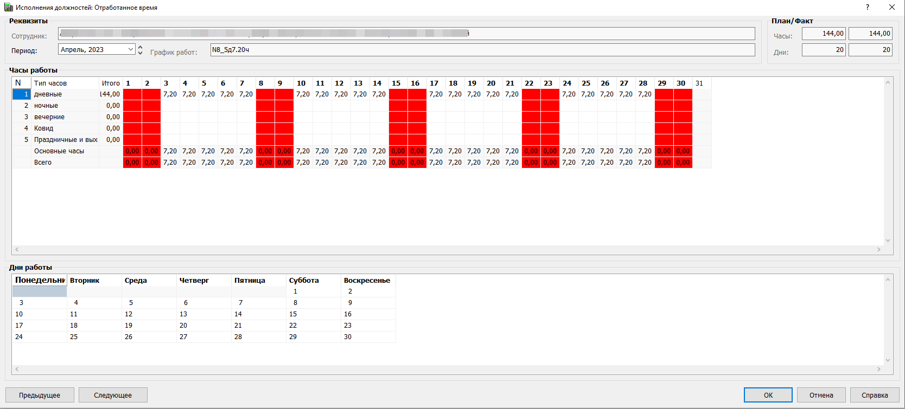
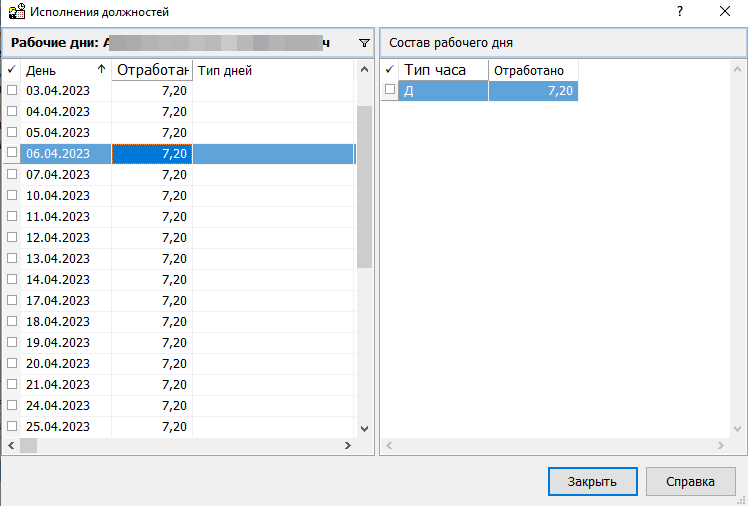

# Дипломный проект
* Учебное заведение: GeekBrains
* Курс: ИТ-инженер Передовые технологии Пакет Базовый
* Специализация: Разработчик
* Тема проекта: Исследование языка программирования Java и стека технологий на примере создания веб-приложения для ведения графиков работ в производственных условиях
* ФИО: Чаган Александр Владимирович
* Место и год написания: г. Тольятти, 2023 год

## Тема проекта: Исследование языка программирования Java и стека технологий на примере создания веб-приложения для ведения графиков работ в производственных условиях

## Цель: Изучить особенности объектно-ориентированного языка программирования Java и сопутствующих ему технологий для реализации веб-приложения.

## Оглавление
* [Задачи](#задачи)
* [Инструменты](#инструменты)
* [Структура приложения](#структура-приложения)
* [Примерный внешний вид](#примерный-внешний-вид)
* [Стек технологий](#стек-технологий)
* [Введение](#введение)
* [Глава 1. Язык написания приложения Java](#глава-1-язык-написания-приложения-java)
* [Глава 2. Серверная часть проекта](#глава-2-серверная-часть-проекта)
* [Глава 3. Клиентская часть проекта](#глава-3-клиентская-часть-проекта)
* [Глава 4. База данных MySQL](#глава-4-база-данных-mysql)
* [Глава 5. Git, GitHub, GitLab](#глава-5-git-github-gitlab)
* [Заключение](#заключение)

## Задачи:
* Изучить литературу по теме исследования
* Рассмотреть основные приемы ООП
* Ознакомится и поработать с синтаксисом языка программирования Java
* Освоить навыки работы с прикладными инструментами для построения веб-приложений
* Ознакомится со стеком технологий на стороне клиента: CSS/HTML/JS
* Ознакомится со стеком технологий на стороне сервера: nginx, apache, tomcat
* Построить веб-приложение для ведения Графиков работы в производственной сфере
* Настроить интеграцию с внешним приложением

## Инструменты:
* IntelliJ Idea
* Git
* GitHab/GitLab

## Структура приложения
* веб-интерфейс
* веб-сервер
* база данных
* интеграция с внешней базой данных

## Примерный внешний вид
* общий вид

*
* вид за период

## Стек технологий
* Язык Java - как основа серверной части
* Spring, Spring Boot - для упрощения написания серверной части
* База данных MySQL - для хранения данных приложения
* База данных Oracle - данные внешнего приложения
* CSS/HTML - написание браузерной части
* Сервер с ОС Linux
* Веб-сервер nginx - для обработки статических файлов
* Веб-сервер apache - для обработки динамических сведений приложения
* Git - для сохранения приложения на этапах разработки
* GitHub - для дальнейшего опубликования 

## Введение

* Веб-приложение для заполнения графика работы и передачи сведений в базу данных расчетного отдела (oracle)
Разработка является дополнительным сервисом к основной программе. 
* 
* Задача, которую предстоит решить возникла глядя на то, как сотрудники учреждения
в разных отделениях в файле Excel или LibreOffice заполняют графики работы сотрудников,
распечатывают из на бумагу, подписывают и затем отдают подписанный бланк расчетчикам.
Те в свою очередь, вносят эти сведения в программу Парус 8. И эта последняя часть ложится
на плечи и без того загруженных бухгалтеров-расчетчиков.
*
* Какие есть варианты, чтобы упростить работу.
  * Купить дополнительный модуль с количеством лицензий на всех старших по отделениям (не маленькие деньги)
  * Написать веб-приложение, в которое старшие в отделениях будут вносить сведения в графики на сотрудников. И после подписания, могли бы отправить в базу Бухгалтерии.
    Я остановился на втором варианте.

## Глава 1. Язык написания приложения Java

## Глава 2. Серверная часть проекта

## Глава 3. Клиентская часть проекта

## Глава 4. База данных MySQL

## Глава 5. Git, GitHub, GitLab

## Заключение